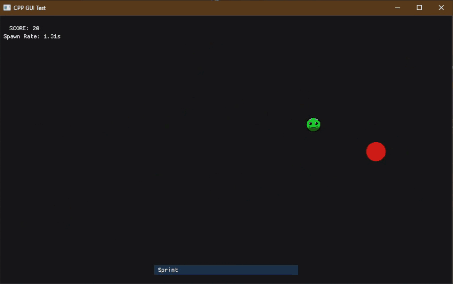

# CPP GUI Tests

A collection of **C++ Games and Tech Demos** built entirely using the **Dear ImGui** library.

I created this repository as a learning exercise to master the **Dear ImGui** immediate mode GUI library.

  
  
  

---

## Download & Installation

Both projects are compiled and available for download.

1.  Go to the **[Releases](../../releases)** page.
2.  Download the `.zip` file for the project you wish to try.
3.  **Extract the Zip:** It is important to extract all files into a folder.
4.  Double-click the `.exe` to run! (No installation needed).

> [!TIP]
> **Customization:** For GDodge, you can change your character's look! Simply replace the `mc.png` file in the folder with any other PNG image (just keep the name the same).

---

## Project 1: GDodge (2D)

A fast-paced survival game where you dodge enemies and manage stamina.

### Features
* **Custom Characters:** Change your player sprite by swapping the `mc.png` file in the game directory.
* **Infinite Difficulty Scaling:** Enemies spawn in waves. The longer you survive, the faster they spawn.
* **Stamina System:** Sprint mechanics with a visual stamina bar and overheat cooldown punishment.
* **Precise Hitboxes:** Dynamic circular collision detection that scales perfectly with the player's visual size.
* **Game State Management:** Complete flow from Start Menu → Gameplay → Game Over screen.

### Controls
| Action | Key 1 | Key 2 |
| :--- | :--- | :--- |
| **Move** | `WASD` | `Arrow Keys` |
| **Sprint** | `LShift` | `RShift` |
| **Start / Retry** | `Enter` | `Space` |

---

## Project 2: 3DEngine (3D)

https://github.com/user-attachments/assets/cdc111b6-e4aa-4b73-b311-01c0932a5bdd

A "Minecraft-style" 3D rendering and physics engine running inside an ImGui window. This project focuses on complex 3D math and collision logic.

### Features
* **3D Camera System:** Full First-Person mouse look (Yaw/Pitch) and movement.
* **Advanced Physics:** Gravity acceleration, jumping mechanics, and velocity-based movement.
* **Voxel Collision:**
    * **AABB Collision:** Prevents clipping through blocks.
    * **Wall Sliding:** Smart axis-separation allowing players to slide along walls rather than getting stuck.
    * **Step Logic:** Automatically detects if a block is low enough to step on or requires a jump.
* **Terrain Generation:** Renders a voxel-based world grid.

### Controls
| Action | Key |
| :--- | :--- |
| **Move** | `WASD` |
| **Look** | `Mouse` |
| **Jump** | `Space` |

---

## Technical Details (How It Works)

Since this was a learning project, the architecture focuses on pushing `ImGui::GetWindowDrawList()` to its limits.

### 1. Rendering Strategy
* **2D Mode:** Uses `AddCircleFilled()` for enemies and `ImGui::Image()` for the player. The player texture is loaded dynamically via `stb_image`.
* **3D Mode:** Projects 3D world coordinates into 2D screen space using a custom Camera Matrix (Perspective Projection), then draws quads using the DrawList API to simulate 3D blocks.

### 2. Collision Logic
* **2D Collision:** Uses Euclidean distance $\sqrt{(x_2-x_1)^2 + (y_2-y_1)^2}$ for Circle-to-Circle checks.
* **3D Collision:** Implements strictly defined bounding boxes. It checks "future positions" (velocity integration) against the terrain heightmap to determine if a move is valid, if the player should slide, or if gravity should apply.

## Acknowledgments

* **[Ocornut](https://github.com/ocornut)** for creating the incredible Dear ImGui library.
* Built using C++ and DirectX11/Win32 (via ImGui backends).
